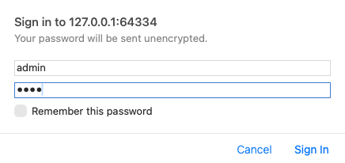
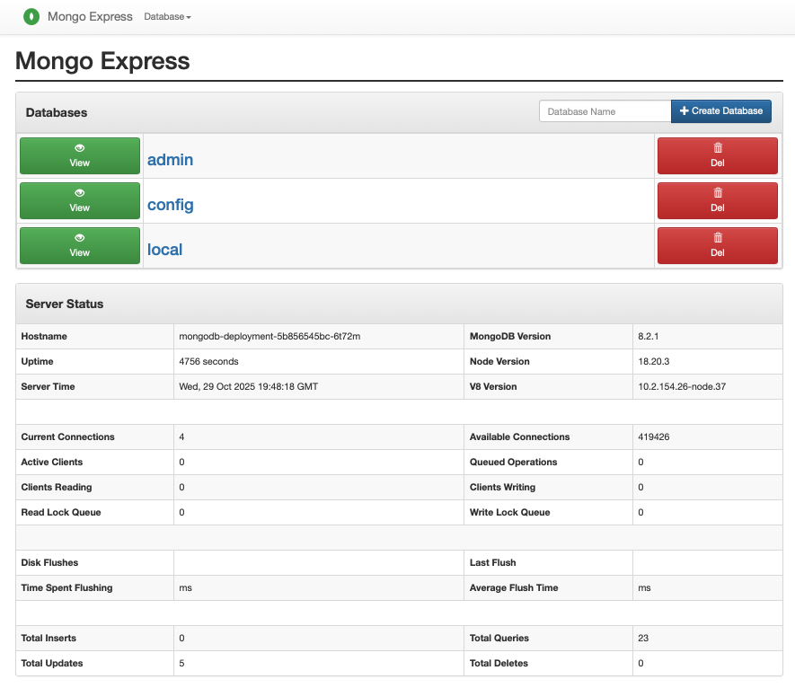

# Mongodb with UI (express)

Run the following commands:

```
% kubectl apply -f mongo-secret.yaml
% kubectl apply -f mongo.yaml
% kubectl apply -f mongo-configmap.yaml
% kubectl apply -f mongo-express.yaml
```

Then, check running deployments:
```
% kubectl get pods,service,deployments.apps,replicasets.apps,secrets,configmaps --namespace mongodb
NAME                                            READY   STATUS    RESTARTS   AGE
pod/mongo-express-deployment-699c65ccdd-4hzk5   1/1     Running   0          25m
pod/mongodb-deployment-5b856545bc-6t72m         1/1     Running   0          74m

NAME                            TYPE           CLUSTER-IP     EXTERNAL-IP   PORT(S)          AGE
service/mongo-express-service   LoadBalancer   10.98.17.71    <pending>     8081:30000/TCP   25m
service/mongodb-service         ClusterIP      10.111.20.94   <none>        27017/TCP        74m

NAME                                       READY   UP-TO-DATE   AVAILABLE   AGE
deployment.apps/mongo-express-deployment   1/1     1            1           25m
deployment.apps/mongodb-deployment         1/1     1            1           74m

NAME                                                  DESIRED   CURRENT   READY   AGE
replicaset.apps/mongo-express-deployment-699c65ccdd   1         1         1       25m
replicaset.apps/mongodb-deployment-5b856545bc         1         1         1       74m

NAME                    TYPE     DATA   AGE
secret/mongodb-secret   Opaque   2      75m

NAME                          DATA   AGE
configmap/kube-root-ca.crt    1      75m
configmap/mongodb-configmap   1      25m

```

In order to see mongodb express service, run the following commands:
```
% minikube service mongo-express-service --namespace mongodb --url
```

then, oprn the given url into a browser. After that, you see the Sing in page (default username: `admin` and password: `pass`)



